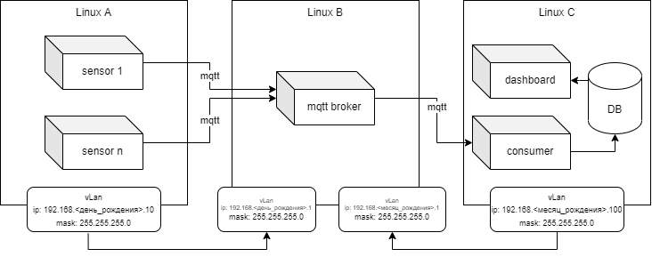

# Введение
Данная практика посвещена базовым принципам Docker. Для выполнения практики необходимо использовать 3 виртуальные машины Linux.

# Задание

Необходимо развернуть следующую систему:

Симуляторы сенсоров, развернутые в докер контейнерах, публикуют сообщения на Mqtt брокер. Сервис Consumer подписывается на все сообщение,
опубликованные в брокере, и заносит их в базу данных временных рядов. Сервис dashboard отображает графики полученных данных от сервисов.

Для выполнения данного задания необходимо:
1. Использовать три виртуальные машины из предыдущей практики. Установить на каждой docker и docker-compose.

2. Linux A.
    1. Разработать скрипты - симулятор технологических данных. Создать класс Sensor, а также наследников этого класса (указать 4 реально существующих типа датчиков, например, температура, давление, потребляемый ток).
    2. В основной программе реализовать клиента, который подключается к mqtt брокеру и публикует сообщения.
    3. Конфигурацию типов датчиков вывести через переменные среды
    4. Запуск реализовать с помощью докер контейнеров. Для запуска нескольких типов использовать docker-compose.
    5. В итоге сделать 4 типа датчиков, запустить 6 контейнеров разных типов, где задается:
      * тип датчика
      * название датчика
      * дискретность публикации сообщений
      * (ДОП ЗАДАЧА, НЕОБЯЗАТЕЛЬНО) тип формулы (подумайте как можно через конфигурацию повлиять на характер генерации нового числа)
        * в формуле предусмотрите в качестве операнда дату вашего рождения (например умножение на год рождения или месяц)
      * (ДОП ЗАДАЧА, НЕОБЯЗАТЕЛЬНО) тип топика (json формат (topic - /sensor/type, value {"name":"sensor1", "value": 22.4} ) или значение в конкретный топик (topic - /sensor/type/value, value - 22.4))
    6. Залить на свою страницу в докерхаб созданный image контейнера в публичный репозиторий.

3. Linux B
    1. Развернуть mosquitto брокер с помощью docker. Настроить проброс портов, необходимый для работы приложения.
    2. Настроить конфигурационный файл для брокера. Использовать volume для подгрузки файла в докер.
    3. В файрволе открыть порт, необходимый для работы брокера.
4. Linux C
    1. Развернуть influxdb (1.8 версия), telegraf, grafana  с помощью docker-compose
    2. Настроить подписку телеграфа на mqtt топики брокера
    3. Сохранять все сообщения в influxdb
    4. В grafana вывести дашборды с текущими значениями всех датчиков и агрегированными показаниями (среднее значение по всем датчикам) - сделать скриншот
    5. Необходимо создать volume для каждого контейнера с конфигурационными файлами. (ДОП ЗАДАЧА, НЕОБЯЗАТЕЛЬНО) При пересоздании контейнеров конфигурация дашбордов должна сохранится (без самих данных).
    6. В конфигурационных файлах ссылаться по alias контейнеров (не по ip адресам)
5. При загрузки задания в гит репозиторий создать две ветки develop и master. В master загрузить только readme - задание. 
   В ветку develop - загружаем сделанное задание. Как только отправляете мне на проверку задание, создаете пул реквест в ветку мастер и назначаете меня ревьювером. Таким образом я смогу комментировать ваш репозиторий.
6. Оформить инструкцию в виде Markdown файла. Приложить конфигурационные файлы в репозиторий.  
   Критерием успеха выполнения задания будет являтся также написанная инструкция по запуску ваших контейнеров. То есть, если я загружу с докерхаба ваш image, запущу docker-compose файлы на своих виртуальных машинах, и при этом смогу зайти в интерфейс и посмотреть дашборд с потоком данных, то задание выполнено.

Репозиторий оформить следующим образом:
- root
  - assets
    - images - картинки для отчета
  - vms
    - client
      - simulator - код симулятора и докерфайл
    - gateway
      - mosquitto - папка с конфигом для mosquitto + sh скрипт по запуску докера
    - server
      - grafana - конфиги для тома графаны
      - influxdb - конфиги для тома инфлукса
      - telegraf - конфиги для тома телеграфа
      - docker-compose.yml
      
  - report.md - Отчет markdown

P.S. опираться можно на данную [статью](https://coderlessons.com/articles/programmirovanie/raspberry-pi-iot-datchiki-influxdb-mqtt-i-grafana)
