## Разработка скриптов

Создадим проект на с# (.net 6), в котором будут определенны классы сенсоров (сенсор температуры, давления и потока), которые генерируют данные. Все сенсоры являются наследниками класса Sensor. В основной программе реализован клиент, который подключается к mqtt брокеру и публикует сообщения.


## Работа с докерами

Далее настроим конфигурационный файл докер образа

```dockerfile
FROM mcr.microsoft.com/dotnet/runtime:6.0 AS base
WORKDIR /app

FROM mcr.microsoft.com/dotnet/sdk:6.0 AS build
WORKDIR /src
COPY ["Simulator/Simulator.csproj", "Simulator/"]
RUN dotnet restore "Simulator/Simulator.csproj"
COPY . .
WORKDIR "/src/Simulator"
RUN dotnet build "Simulator.csproj" -c Release -o /app/build

FROM build AS publish
RUN dotnet publish "Simulator.csproj" -c Release -o /app/publish

FROM base AS final
WORKDIR /app
COPY --from=publish /app/publish .
ENTRYPOINT ["dotnet", "Simulator.dll"]
```

Запустим docker контейнер mqtt брокера mosquitto пока что для проверки работы брокера 

```shell
$ docker run -it --rm -p 1883:1883 -v $PWD\mosquitto\config\mosquitto.conf:/mosquitto/mosquitto.conf  eclipse-mosquitto
```

Конфигурационный файл ```mosquitto.conf```:

```yaml
listener 1883
allow_anonymous true
```

Выполним компиляцию докер-образа в windows powershell

```shell
$ docker build -t yuntys/simulator -f .\Simulator\Dockerfile .
```
 
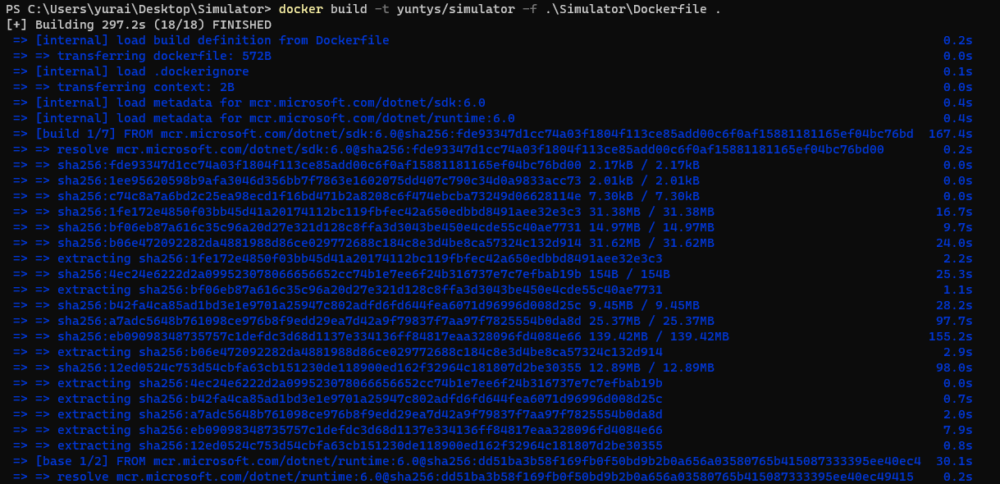 


В результате в DockerHub у нас появились эти образы

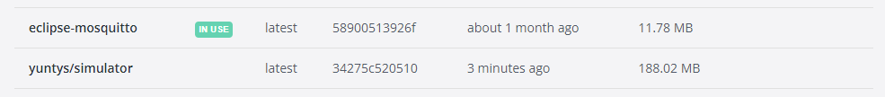 


Запустим симулятор с переменными окружения

```shell
$ docker run --rm 
    -e SIM_NAME=TemperatureSensor_001
    -e SIM_PERIOD=1000 
    -e SIM_TYPE=TemperatureSensor 
    -e SIM_HOST=192.168.1.2 
    yuntys/simulator simulator
```

Если подключится к mqtt брокеру на ```localhost:1883```, то мы увидим, что появились топик, и в нем обновляется значение

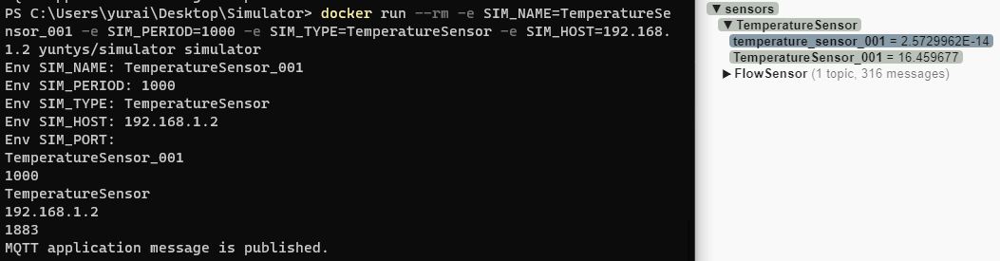 

Теперь запушим образ контейнера репозиторий моего Docker Hub

```shell
$ docker image push yuntys/simulator:latest
```

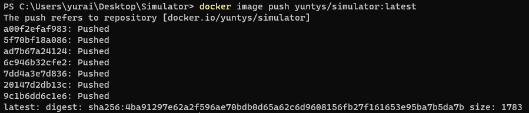


Добавим следующие переменные в файл переменных окружения ```variables.env```:
```yaml
ENV_PORT="1883"
ENV_HOST="192.168.10.10"
```
Добавим следующие конфигурации в ```docker-compose.yml``` файла чтобы  запустить несколько контейнеров с сенсорами:
```yaml
version: '3'

services:
  temperatureSensor:
    image: yuntys/simulator
    environment:
      - SIM_PORT=${ENV_PORT}
      - SIM_HOST=${ENV_HOST}
      - SIM_NAME=TemperatureSensor_001
      - SIM_PERIOD=1000
      - SIM_TYPE=TemperatureSensor
  pressureSensor:
    image: yuntys/simulator
    environment:
      - SIM_PORT=${ENV_PORT}
      - SIM_HOST=${ENV_HOST}
      - SIM_NAME=PressureSensor_001
      - SIM_PERIOD=1000
      - SIM_TYPE=PressureSensor
  flowSensor:
    image: yuntys/simulator
    environment:
      - SIM_PORT=${ENV_PORT}
      - SIM_HOST=${ENV_HOST}
      - SIM_NAME=FlowSensor_001
      - SIM_PERIOD=2500
      - SIM_TYPE=FlowSensor
```

Запустим получившуюсю композицию из контейнеров:
```shell
$ docker-compose --env-file .\variables.env up --no-deps --build
```

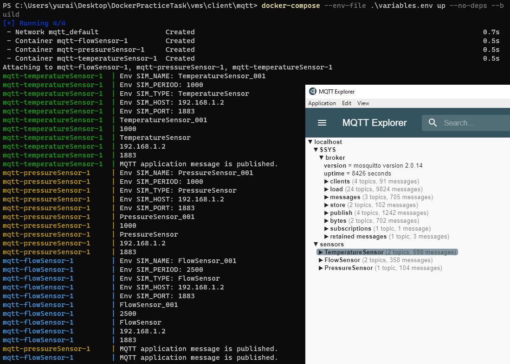

В MQTT брокере появились новые топики и данные.

В DockerHub появилась композиция с контейнерами. 

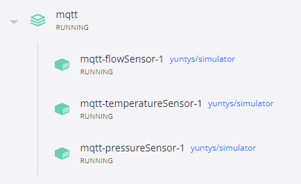


## Работа в линуксе

Для начало произведем проброс портов для будущей работы с grafana

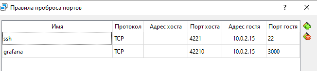


Перекидываем файлы на линукс машины:
Пересем файлы для работы в виртуальные машины

```shell
scp -P 4221 -r .\vms\server\infra ivanchev_1@localhost:/home/ivanchev_1/infra
scp -P 4222 -r .\vms\gateway\mosquitto ivanchev_2@localhost:/home/ivanchev_2/mosquitto
scp -P 4223 -r .\vms\client\mqtt ivanchev_3@localhost:/home/ivanchev_3/mqtt
```

Пока отключим нетплан на всех машинах для установки и тестирования
```shell
$ sudo vim /etc/netplan/00-installer-config.yaml
$ sudo netplan --debug apply
```

Для работы с докером установим его на все машины 
```shell
$ sudo apt-get install docker
$ sudo apt-get install docker-compose
```

## Работа в Gateway

```shell
$ sudo docker run -p 1883:1883 -v $PWD/mosquitto/mosquitto.conf:/mosquitto/config/mosquitto conf --name broker eclipse-mosquitto
```

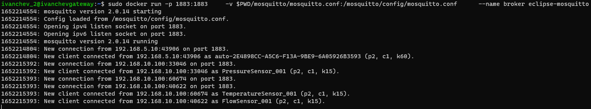

Теперь изменим iptables, добавив в него правила для порта 1883
```shell
$ sudo iptables -L
$ sudo iptables -A OUTPUT -o enp0s8 -p tcp --syn --dport 1883 -m conntrack --ctstate NEW,ESTABLISHED,RELATED -j ACCEPT
$ sudo iptables -A OUTPUT -o enp0s9 -p tcp --syn --dport 1883 -m conntrack --ctstate NEW,ESTABLISHED,RELATED -j ACCEPT
$ sudo iptables -A INPUT -i enp0s8 -p tcp --syn --dport 1883 -m conntrack --ctstate NEW,ESTABLISHED,RELATED -j ACCEPT
$ sudo iptables -A INPUT -i enp0s9 -p tcp --syn --dport 1883 -m conntrack --ctstate NEW,ESTABLISHED,RELATED -j ACCEPT
```

И сохраним
```shell
$ sudo su
root# sudo iptables-save > /etc/iptables/rules.v4
root# sudo ip6tables-save > /etc/iptables/rules.v6
root# exit
```

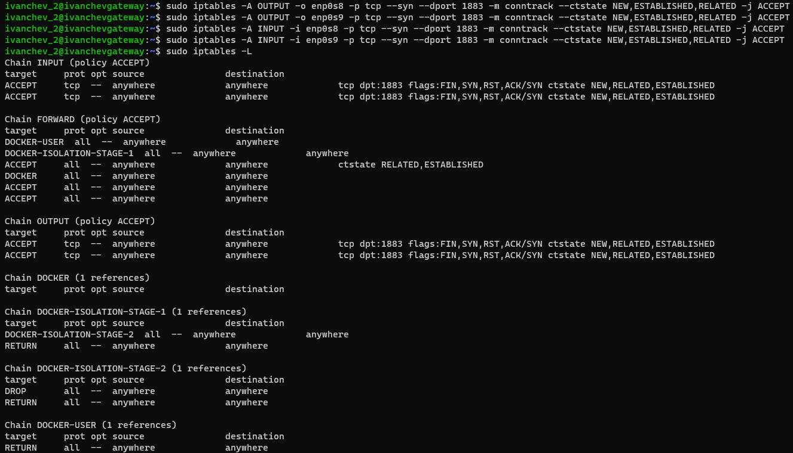

Также мы вернули нетпланы клиента и сервера в первоначальное состояние

При проверке пакетов через tcpdump можно увидить что все проходит

```shell
$ sudo tcpdump -i enp0s9 not icmp
```


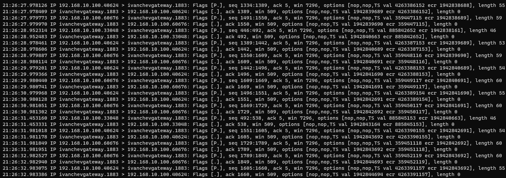

## Работа в  Client

```shell
$ cd mqtt/
$ docker-compose --env-file .\variables.env up --no-deps --build
```

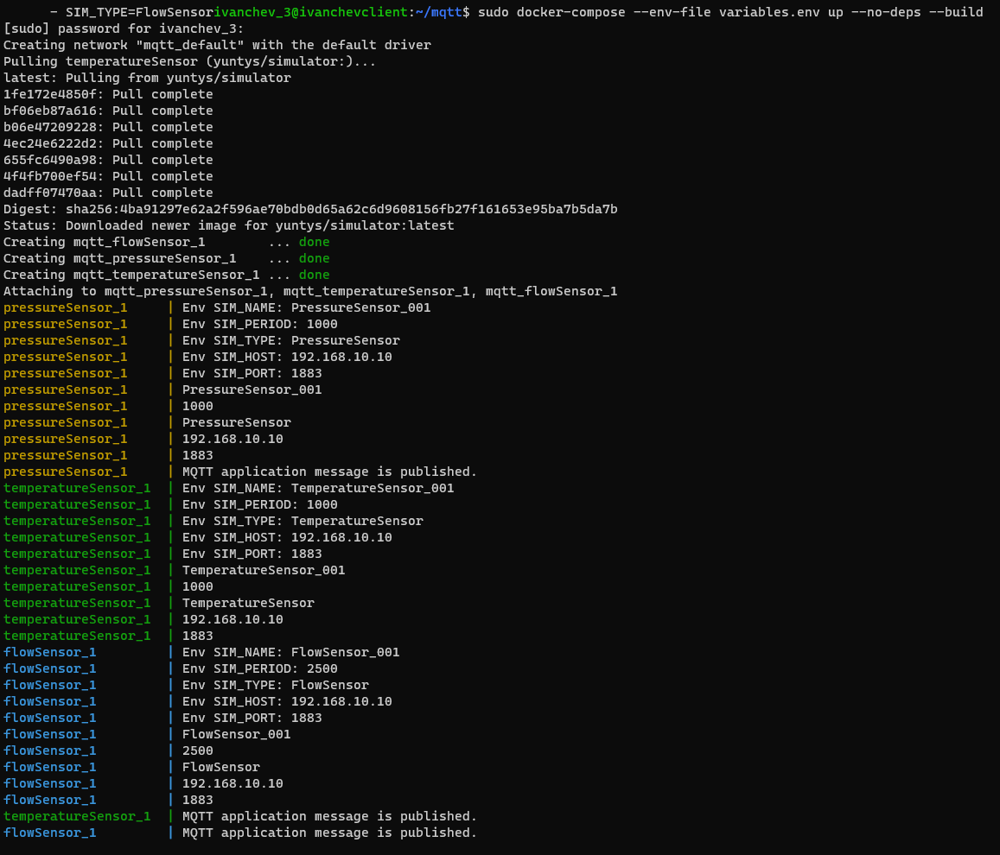

## Работа в Server

```shell
$ sudo apt-get install mosquitto
$ sudo apt  install mosquitto-clients
```

Клиент mqtt
```shell
$ mosquitto_sub -h 192.168.5.1 -F '\e[92m%t \e[96m%p\e[0m' -q 2 -t '#'
```

```shell
$ cd infra/
$ sudo docker-compose up
```

Данные приходят на сервер

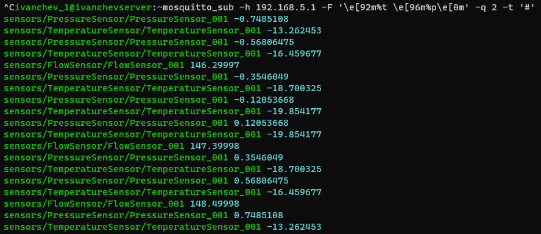

---

Теперь подключимся к Grafana. Для этого в браузере подключаемся к ```localhost:42210``` (через порт который мы пробросили)

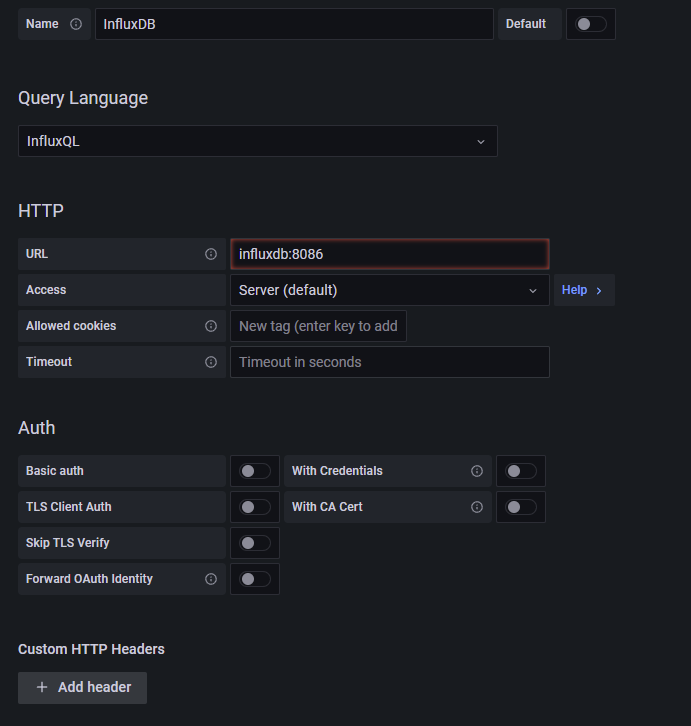

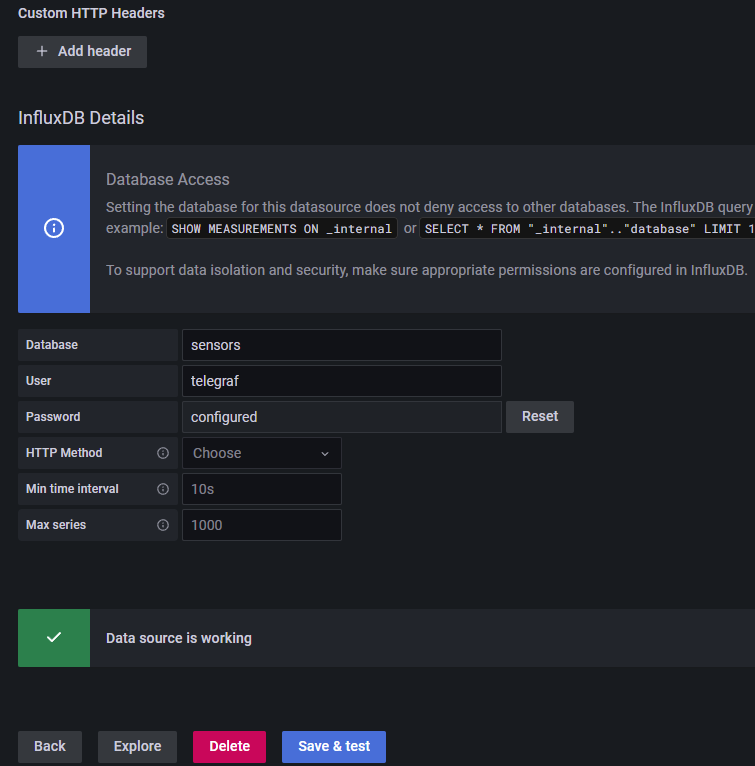

После некоторых манипуляций получили следующие графики

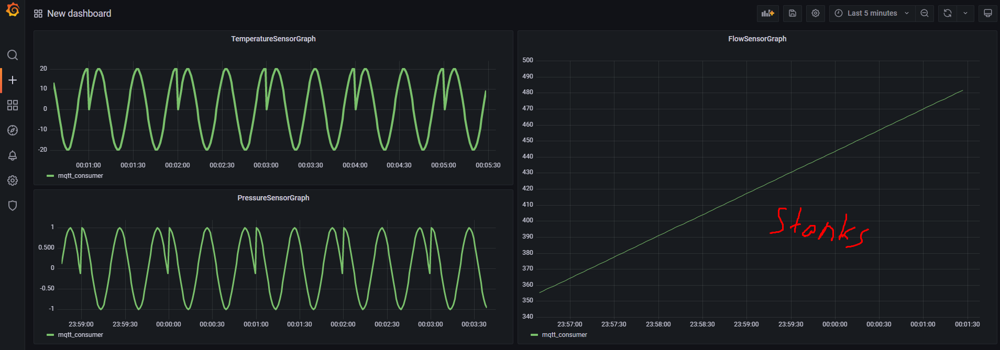
